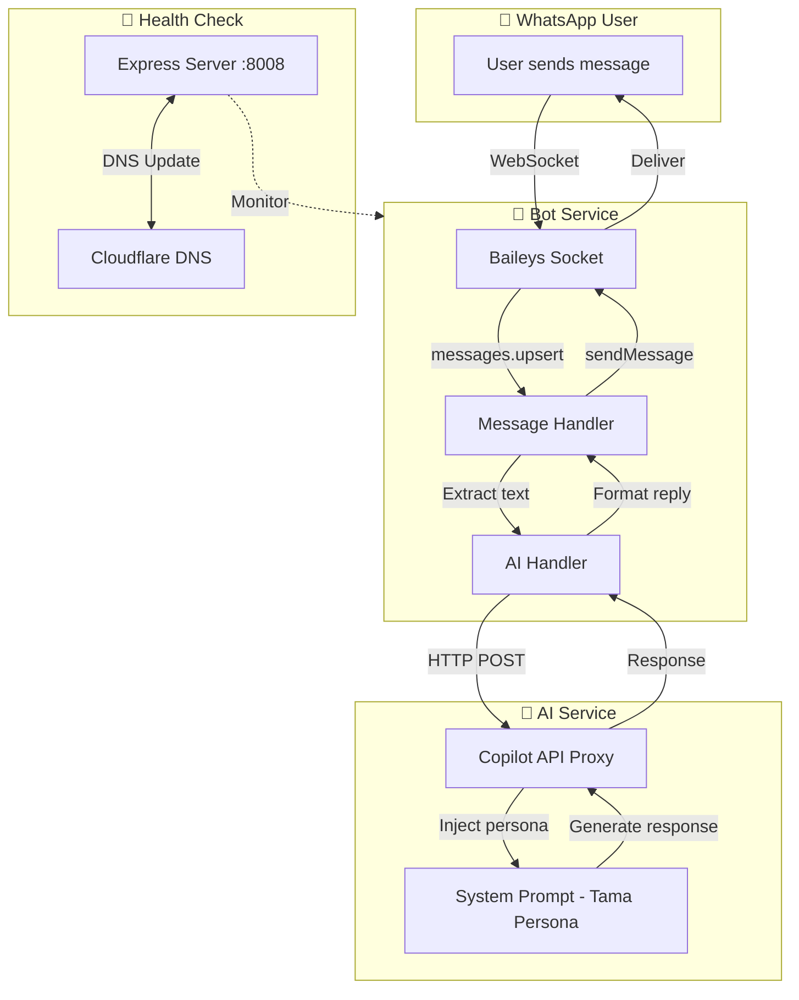
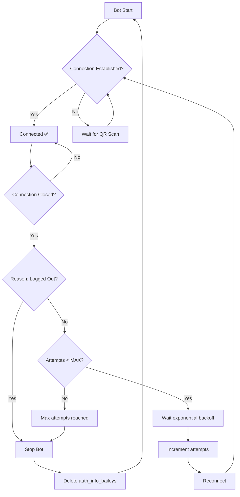
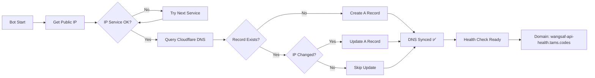
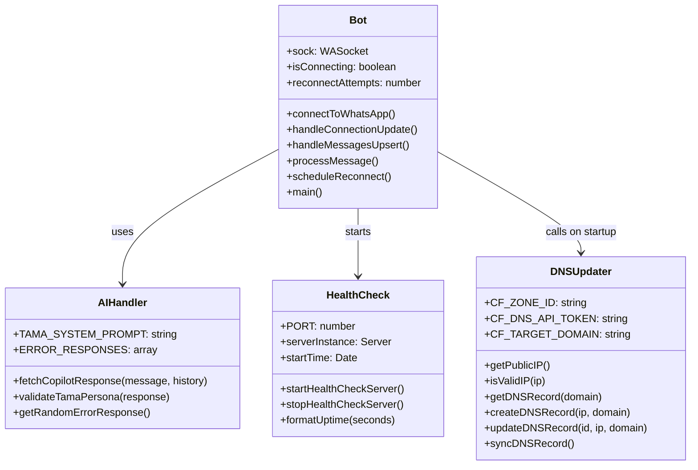

# 🤖 AI WhatsApp Chatbot - Tama Clone

> Bot WhatsApp dengan kepribadian "Tama" - anak IT introvert yang friendly, suka begadang, dan selalu helpful meski sering ngeluh 😭

[](https://nodejs.org/)
[](https://jestjs.io/)
[](LICENSE)

## 📋 Deskripsi

Project ini adalah AI WhatsApp Chatbot yang menggunakan library `@whiskeysockets/baileys` untuk koneksi WhatsApp, terintegrasi dengan AI via Copilot API Proxy. Bot ini memiliki persona spesifik bernama "Tama" - seorang mahasiswa Sistem Informasi yang punya gaya bicara unik dengan ciri khas:

- **Kata ganti**: "w", "gw", "aku" (bukan "saya")
- **Ekspresi**: "jir", "akh", "euy", "gelo", "anjir"
- **Emoji**: 😭 😓 😩 🤣 💀
- **Typo disengaja**: "bntar", "gatau", "gmn", "bgt"
- **Tone**: Kasual, suka ngeluh, tapi tetap helpful

## 🏗️ Architecture Diagram



## 🔄 Reconnection Logic Flowchart



## 🌐 DNS Update Flow



## 📁 Project Structure

```
ai-whatsapp-chatbot/
├── src/
│   ├── bot.js              # Main entry - Baileys socket & handlers
│   ├── aiHandler.js        # AI integration & Tama persona
│   ├── healthCheck.js      # Express health check server
│   └── dnsUpdater.js       # Cloudflare DNS automation
├── tests/
│   ├── setup.js            # Jest environment setup
│   ├── aiHandler.test.js   # AI module unit tests
│   ├── healthCheck.test.js # Health check unit tests
│   └── dnsUpdater.test.js  # DNS module unit tests
├── auth_info_baileys/      # WhatsApp session (auto-generated)
├── .env                    # Environment variables (JANGAN COMMIT!)
├── .env.example            # Template environment
├── .gitignore
├── jest.config.js
├── package.json
└── README.md
```

## 📦 Module Structure



## 🚀 Setup Guide

### Prerequisites

- Node.js v18+ (LTS recommended)
- NPM atau Yarn
- WhatsApp account untuk scan QR
- Copilot API Proxy running (optional, bisa di localhost)

### Installation

1. **Clone repository**
   ```bash
   git clone https://github.com/el-pablos/ai-whatsapp-chatbot.git
   cd ai-whatsapp-chatbot
   ```

2. **Install dependencies**
   ```bash
   npm install
   ```

3. **Setup environment variables**
   ```bash
   cp .env.example .env
   nano .env  # Edit sesuai kebutuhan
   ```

4. **Isi file `.env`**
   ```env
   # Cloudflare Configuration
   CF_ZONE_ID=your_cloudflare_zone_id
   CF_DNS_API_TOKEN=your_dns_api_token
   CF_TARGET_DOMAIN=your-health-check.domain.com

   # Copilot API Configuration
   COPILOT_API_URL=http://localhost:4141
   COPILOT_API_MODEL=gpt-4o

   # Health Check Server
   HEALTH_CHECK_PORT=8008
   ```

5. **Start Copilot API Proxy** (jika belum running)
   ```bash
   # Di terminal terpisah, jalankan copilot-api
   npx copilot-api
   ```

6. **Jalankan bot**
   ```bash
   npm start
   ```

7. **Scan QR Code**
   - QR akan muncul di terminal
   - Buka WhatsApp di HP → Settings → Linked Devices → Link a Device
   - Scan QR code yang muncul

### Running Tests

```bash
# Run all tests dengan coverage
npm test

# Run tests dalam watch mode (development)
npm run test:watch
```

## 📡 API Documentation

### Health Check Endpoints

Bot menjalankan Express server di port `8008` (configurable) dengan endpoints:

#### `GET /`

Main health check endpoint.

**Response:**
```json
{
  "status": "ok",
  "uptime": 3600,
  "uptimeFormatted": "1h 0m 0s",
  "timestamp": "2026-02-01T10:00:00.000Z",
  "service": "AI WhatsApp Chatbot - Tama",
  "version": "1.0.0"
}
```

#### `GET /health`

Simple health check.

**Response:**
```json
{
  "status": "ok",
  "healthy": true
}
```

#### `GET /status`

Detailed system status termasuk memory usage.

**Response:**
```json
{
  "status": "ok",
  "uptime": 3600,
  "memory": {
    "heapUsed": "45 MB",
    "heapTotal": "60 MB",
    "rss": "80 MB"
  },
  "pid": 12345,
  "nodeVersion": "v18.19.0"
}
```

## 🎭 Tama Persona Examples

Bot akan merespons dengan gaya bicara Tama:

| User Message | Bot Response |
|-------------|--------------|
| "Halo" | "yoo wazzup jir, ada apa nih? 😎" |
| "Gimana cara belajar coding?" | "wahh asik nih mau bljr coding, gampang jir bntar w jelasin ya..." |
| "Capek banget hari ini" | "sama jir 😭 w jg capek bgt, bntr lg w mau turu deh kayaknya" |
| "Error nih sistemnya" | "duh error euy sistem w 😓 coba lgi nnt ya" |

## 🔧 Configuration Reference

| Variable | Description | Default |
|----------|-------------|---------|
| `CF_ZONE_ID` | Cloudflare Zone ID | - |
| `CF_DNS_API_TOKEN` | Cloudflare API Token | - |
| `CF_TARGET_DOMAIN` | Domain untuk health check | - |
| `COPILOT_API_URL` | URL Copilot API Proxy | `http://localhost:4141` |
| `COPILOT_API_MODEL` | Model AI yang digunakan | `gpt-4o` |
| `HEALTH_CHECK_PORT` | Port untuk health check server | `8008` |
| `LOG_LEVEL` | Pino log level | `info` |

## 🐛 Troubleshooting

### QR Code tidak muncul
- Pastikan folder `auth_info_baileys` tidak corrupt
- Hapus folder dan jalankan ulang: `rm -rf auth_info_baileys && npm start`

### Bot tidak merespons
- Cek koneksi internet
- Pastikan Copilot API Proxy running
- Cek logs untuk error messages

### DNS Update gagal
- Validasi API Token Cloudflare
- Pastikan Zone ID benar
- Cek apakah domain sudah terdaftar di Cloudflare

### Test gagal
- Jalankan `npm install` ulang
- Pastikan port 8888 tidak digunakan (untuk test)

## 📝 Development Notes

- Semua modules di-export untuk testing
- Mock axios untuk isolasi network calls dalam tests
- Coverage threshold: 80% lines, 70% branches
- Commit messages menggunakan format Indonesian kasual

## 🤝 Contributing

1. Fork repository
2. Buat branch baru: `git checkout -b feat/fitur-baru`
3. Commit changes dengan format yang benar
4. Push ke branch
5. Buat Pull Request

## 📄 License

MIT License - feel free untuk digunakan dan dimodifikasi!

---

**Made with 💜 by Tama (el-pablos)**

*"akh gakuat aku pngn tiduran dlu 😭"* - Tama, 2026
