# 🤖 Tama AI WhatsApp Bot

> AI-powered WhatsApp chatbot with authentic Indonesian persona — powered by Claude Sonnet 4.5

[](CHANGELOG.md)
[](https://nodejs.org)
[](tests/)
[](https://anthropic.com)
[](LICENSE)

---

## 📖 Table of Contents

- [Overview](#-overview)
- [Key Features](#-key-features)
- [Architecture](#-architecture)
- [AI Integration](#-ai-integration)
- [Module Documentation](#-module-documentation)
- [Quick Start](#-quick-start)
- [Configuration](#️-configuration)
- [API Reference](#-api-reference)
- [Testing](#-testing)
- [Security](#-security)
- [Troubleshooting](#-troubleshooting)
- [Contributing](#-contributing)
- [License](#-license)

---

## 🎯 Overview

Tama AI adalah WhatsApp chatbot berbasis AI yang menggunakan **Claude Sonnet 4.5** sebagai otak utama. Bot ini dirancang dengan persona **natural Indonesian (bahasa gaul Jakarta)** — bukan bot kaku yang formal, tapi AI yang bisa ngobrol santai kayak temen.

### ✨ Highlights

| Feature | Description |
|---------|-------------|
| 🎭 **Natural Persona** | Gaya bicara gaul Jakarta: "w", "gw", "cuy", "wkwkwk" |
| 🧠 **AI-First Design** | Semua response diproses Claude Sonnet 4.5 |
| 💾 **Unlimited Memory** | SQLite conversation history tanpa limit |
| 📄 **70+ Document Formats** | PDF, DOCX, EPUB, ZIP, dan banyak lagi |
| 🌤️ **Real-time Data** | Cuaca BMKG, web search, YouTube info |
| 🔮 **Entertainment** | Tarot 78 kartu, mood reading, zodiak |

---

## 🚀 Key Features

### 💬 AI Chat dengan Persona Tama

```
User: "bro bisa bantuin ga?"
Tama: "uhuy bisa cuy, apaan nih?"

User: "cara install python gimana?"
Tama: "ez cuy
download aja di python.org
trus next next aja
gampang kok"
```

### 📄 Universal Document Reader

Mendukung **70+ format** dokumen tanpa batasan ukuran:

| Category | Formats |
|----------|---------|
| **Office** | DOC, DOCX, ODT, RTF, PPT, PPTX, XLS, XLSX, Pages |
| **PDF** | PDF (dengan OCR support) |
| **eBooks** | EPUB, MOBI, AZW, AZW3, FB2, DJVU, CHM |
| **Archives** | ZIP, RAR, 7Z, TAR, GZ, BZ2, XZ |
| **Text** | TXT, MD, HTML, JSON, XML, YAML, CSV |
| **Presentations** | PPT, PPTX, ODP, KEY |

### 🌤️ Weather & Earthquake (BMKG)

Data resmi dari BMKG Indonesia:
- Cuaca real-time 60+ kota Indonesia
- Info gempa terkini
- Prakiraan cuaca

```
User: "cuaca jakarta gimana hari ini?"
Tama: "🌤️ Cuaca Jakarta hari ini cerah berawan, suhu 32°C..."
```

### 🎬 YouTube Downloader

- Auto-detect YouTube URL
- Download sebagai MP3 (audio) atau MP4 (video)
- AI analysis video info
- Max 30 menit, 50MB

### 📍 Location Services

- Pencarian tempat via OpenStreetMap
- Reverse geocoding
- Share lokasi ke WhatsApp

### 🔮 Tarot Reading

- 78 kartu lengkap (Major + Minor Arcana)
- 5 jenis spread: Single, 3-Card, Love, Celtic Cross, Yes/No
- Interpretasi AI dengan konteks personal

### 😊 Mood Reading

- Analisis emosi dari cerita/curhat
- Kategori: positive, negative, neutral
- Saran empati dari AI

---

## 🏗️ Architecture

### High-Level Overview

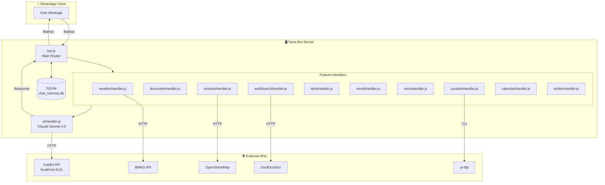

### Request Flow

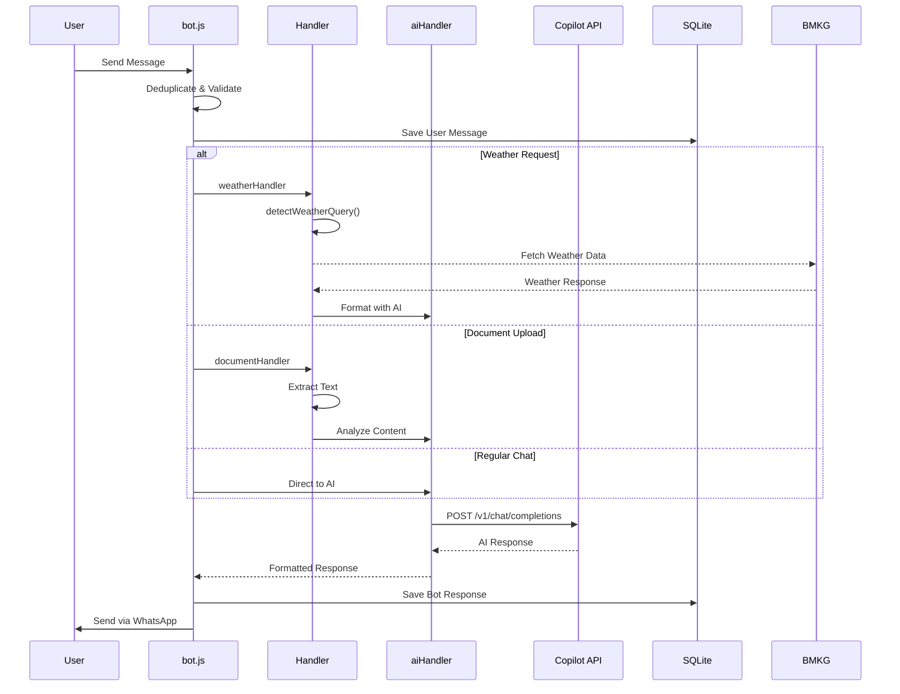

### Module Dependency Graph

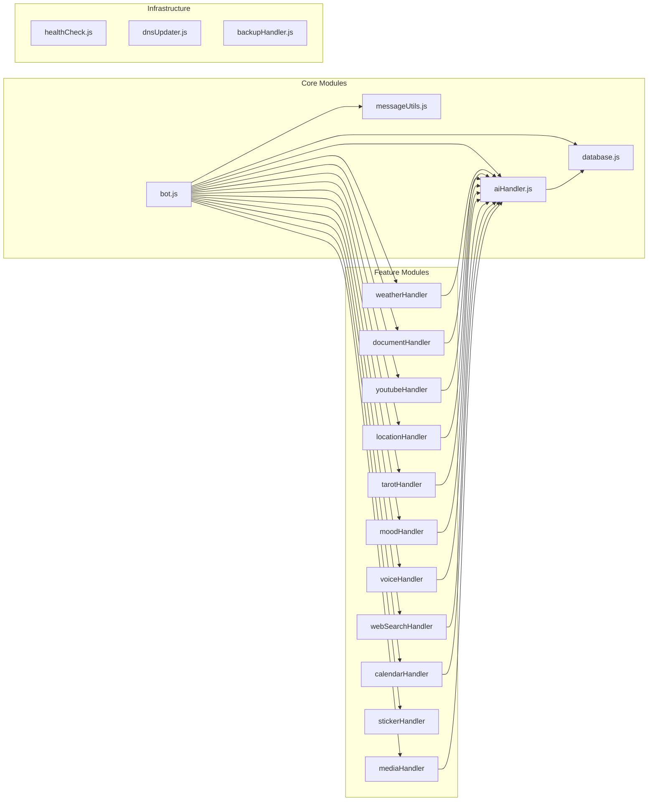

### Directory Structure

```
ai-whatsapp-chatbot/
├── src/
│   ├── bot.js              # Main entry point & router
│   ├── aiHandler.js        # AI/Copilot integration
│   ├── database.js         # SQLite operations
│   ├── messageUtils.js     # Message utilities
│   │
│   ├── weatherHandler.js   # BMKG weather & earthquake
│   ├── documentHandler.js  # 70+ format document reader
│   ├── youtubeHandler.js   # YouTube download (yt-dlp)
│   ├── locationHandler.js  # OpenStreetMap integration
│   ├── tarotHandler.js     # 78-card tarot system
│   ├── moodHandler.js      # Emotion analysis
│   ├── voiceHandler.js     # Speech-to-text (Whisper)
│   ├── webSearchHandler.js # DuckDuckGo search
│   ├── calendarHandler.js  # Dates, holidays, zodiac
│   ├── stickerHandler.js   # Image/video to sticker
│   ├── mediaHandler.js     # Media processing & vision
│   │
│   ├── healthCheck.js      # HTTP health server
│   ├── dnsUpdater.js       # Cloudflare DNS sync
│   └── backupHandler.js    # Auto backup scheduler
│
├── tests/                  # Jest test files
├── data/                   # SQLite database & media
├── auth_info_baileys/      # WhatsApp session (gitignored)
├── downloads/              # YouTube downloads (temp)
├── temp_audio/             # Voice processing (temp)
├── temp_docs/              # Document processing (temp)
├── temp_sticker/           # Sticker processing (temp)
│
├── package.json
├── ecosystem.config.js     # PM2 configuration
├── jest.config.js          # Jest configuration
├── .env.example            # Environment template
└── README.md               # This file
```

---

## 🤖 AI Integration

### Design Philosophy

> **"Sonnet yang mikir, bukan rule-based yang kaku"**

Semua response ke user **WAJIB** diproses oleh Claude Sonnet 4.5, kecuali:
1. Error/failure yang jelas
2. Slash commands yang butuh response instan (e.g., `/kalender`)

### AI Processing Flow

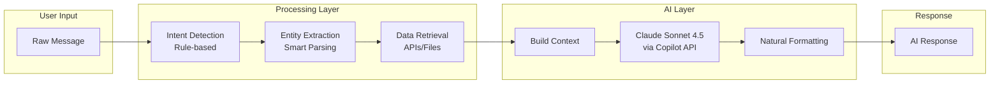

### AI Integration per Module

| Module | Data Source | AI Role | Integration Level |
|--------|-------------|---------|-------------------|
| **Chat** | User message | Full response | 🟢 Full |
| **Weather** | BMKG API | Format & explain | 🟢 Full |
| **Documents** | File content | Analyze & summarize | 🟢 Full |
| **YouTube** | yt-dlp info | Describe & recommend | 🟢 Full |
| **Search** | DuckDuckGo | Summarize results | 🟢 Full |
| **Voice** | Whisper STT | Respond to transcription | 🟢 Full |
| **Location** | OpenStreetMap | Respond to location | 🟢 Full |
| **Calendar** | Static data | Natural formatting | 🟢 Full |
| **Tarot** | 78-card deck | Interpret cards | 🟢 Full |
| **Mood** | Emotion keywords | Analyze & advise | 🟢 Full |
| **Image** | Vision API | Describe & analyze | 🟢 Full |
| **Sticker** | ffmpeg | N/A (media only) | ⚪ N/A |

### Copilot API Configuration

```javascript
// aiHandler.js
const COPILOT_API_URL = process.env.COPILOT_API_URL || 'http://localhost:4141';
const COPILOT_API_MODEL = process.env.COPILOT_API_MODEL || 'claude-sonnet-4.5';

// Request format
POST /v1/chat/completions
{
    model: "claude-sonnet-4.5",
    messages: [
        { role: "system", content: TAMA_SYSTEM_PROMPT },
        ...conversationHistory,
        { role: "user", content: contextualMessage }
    ],
    temperature: 0.85,
    max_tokens: 4096
}
```

### Persona System Prompt

Bot menggunakan system prompt yang detail untuk menjaga konsistensi persona:

```
Karakteristik Tama AI:
├── Kata ganti: "w", "gw", "gweh" (BUKAN "saya")
├── Panggilan: "cuy", "bre", "bos", "king" (BUKAN nama sebelum kenalan)
├── Ketawa: "wokwokwow", "aowkaowka" (typo natural)
├── Ekspresi: "uhuy", "gacor", "gasss", "ez"
├── Singkatan: "bntar", "nnt", "gatau", "gimana"
└── Anti-formal: NO "saya", "Anda", "silakan", "tentu saja"
```

---

## 📚 Module Documentation

### 1. bot.js — Main Router

Entry point dan message router utama.

**Responsibilities:**
- WhatsApp connection via Baileys
- Message deduplication
- Intent routing ke handler yang tepat
- Error handling & reconnection

**Key Functions:**
```javascript
connectToWhatsApp()     // Initialize connection
processMessage(msg)     // Route message to handlers
handleSpecialCommands() // Process slash commands
```

**Message Flow:**
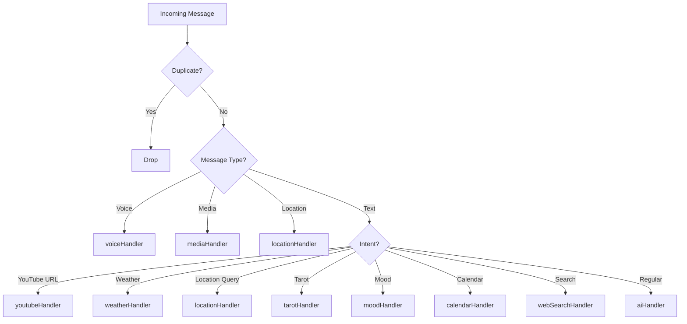

### 2. aiHandler.js — AI Core

Integrasi dengan Copilot API dan persona management.

**Key Functions:**
```javascript
fetchCopilotResponse(message, history, options)
fetchVisionResponse(base64Image, mimetype, caption, history)
getSystemPrompt()
validateTamaPersona(response)
checkDimensiLainLogic(text, senderPhone)
```

**Options:**
```javascript
{
    quotedContent: string,    // Pesan yang di-reply
    mediaDescription: string, // Deskripsi media
    isOwner: boolean,         // Apakah owner bot
    preferredName: string,    // Panggilan custom user
    senderPhone: string       // Nomor pengirim
}
```

### 3. weatherHandler.js — BMKG Weather

Cuaca dan gempa dari BMKG Indonesia.

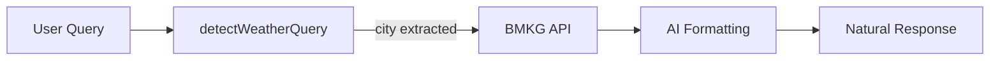

**Smart City Extraction:**
```javascript
// Input: "cuaca hari ini di jakarta gimana?"
// Step 1: Remove fillers → "jakarta"  
// Step 2: Validate city → ✓ Jakarta
// Step 3: Get weather → BMKG data
// Step 4: AI format → Natural response
```

**Filler Word Removal:**
```javascript
const fillerPatterns = [
    /\b(hari\s*ini|sekarang|besok|gimana|bagaimana|dong|deh|ya)\b/gi,
    /\b(cuaca|weather|prakiraan)\b/gi,
    /\b(di|ke|dari)\b/gi,
    /[?!.,]/g
];
```

**Supported Cities:** 60+ kota Indonesia termasuk semua ibukota provinsi.

### 4. documentHandler.js — Universal Reader

Baca 70+ format dokumen.

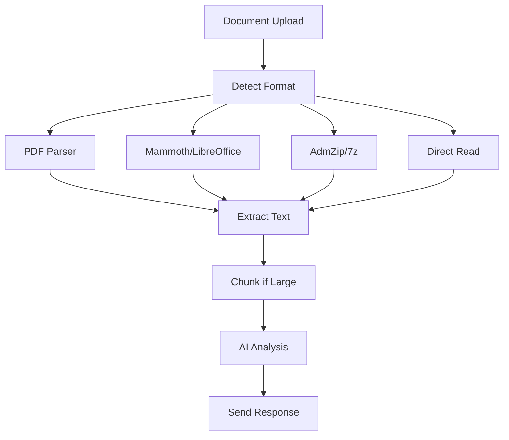

**Features:**
- No size limits
- Progress indicator untuk file besar
- Chunk processing untuk dokumen panjang

### 5. youtubeHandler.js — YouTube Downloader

Download YouTube sebagai MP3/MP4.

**Flow:**
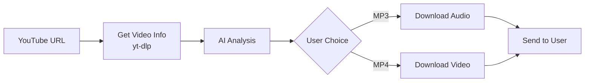

**Limits:**
- Max duration: 30 menit
- Max file size: 50MB (WhatsApp limit)

### 6. locationHandler.js — Geolocation

Pencarian dan sharing lokasi.

**APIs:**
- Nominatim (OpenStreetMap) untuk search
- Reverse geocoding untuk incoming locations

**Request Patterns:**
```javascript
const searchPatterns = [
    /(?:kirim|share)\s+(?:lokasi|alamat)\s+(.+)/i,
    /(?:lokasi|alamat|dimana)\s+(.+?)(?:\s+dong|\?|$)/i,
    /(?:cari|search)\s+(?:lokasi|tempat)\s+(.+)/i
];
```

### 7. tarotHandler.js — Tarot System

78 kartu tarot dengan interpretasi AI.

**Card Distribution:**
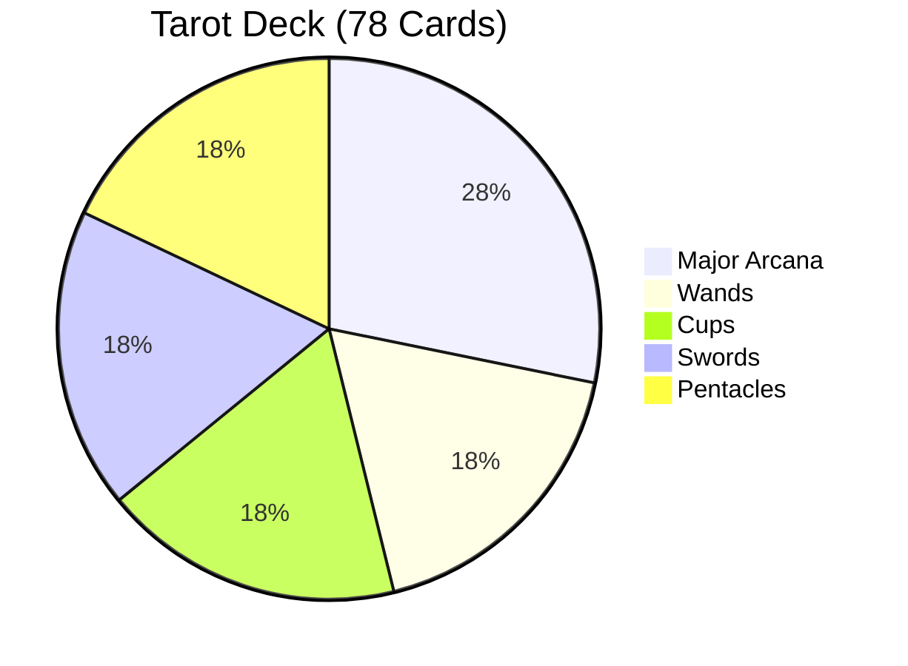

**Spreads:**
| Spread | Cards | Use Case |
|--------|-------|----------|
| Single | 1 | Quick insight |
| Three Card | 3 | Past-Present-Future |
| Love | 5 | Relationship |
| Celtic Cross | 10 | Deep reading |
| Yes/No | 1 | Binary question |

### 8. moodHandler.js — Emotion Analysis

Analisis mood dari cerita/curhat user.

**Mood Categories:**
```javascript
positive: ['happy', 'excited', 'peaceful', 'grateful', 'loved', 'confident', 'hopeful']
negative: ['sad', 'anxious', 'angry', 'frustrated', 'lonely', 'stressed', 'overwhelmed', 'hurt']
neutral: ['confused', 'bored', 'indifferent', 'curious', 'tired']
```

**Analysis Flow:**
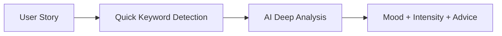

### 9. webSearchHandler.js — Web Search

Pencarian internet via DuckDuckGo.

**NO-SEARCH Guard:**
Bot dilengkapi guard untuk mencegah false positive search:

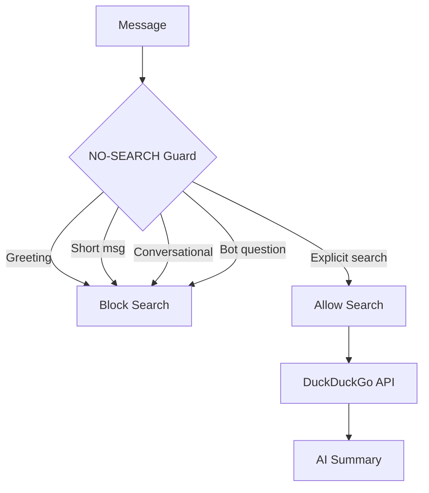

### 10. voiceHandler.js — Voice Notes

Speech-to-text untuk voice notes.

**Flow:**
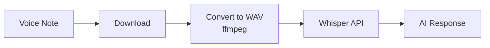

### 11. calendarHandler.js — Calendar

Tanggal, libur, zodiak.

**Data:**
- Libur nasional Indonesia 2024-2026
- 12 zodiak dengan interpretasi
- Kalender ASCII art

### 12. stickerHandler.js — Sticker Maker

Konversi gambar/video ke sticker.

**Requirements:**
- ffmpeg untuk konversi
- Max 512x512 px
- Max 6 detik untuk animated

---

## 🚀 Quick Start

### Prerequisites

- Node.js >= 18.0.0
- npm >= 8.0.0
- ffmpeg (untuk voice & sticker)
- yt-dlp (untuk YouTube)
- Copilot API running (localhost:4141)

### Installation

```bash
# Clone repository
git clone https://github.com/el-pablos/ai-whatsapp-chatbot.git
cd ai-whatsapp-chatbot

# Install dependencies
npm install

# Copy environment template
cp .env.example .env

# Edit configuration
nano .env

# Start bot
npm start
```

### First Run

1. Bot akan menampilkan QR code atau pairing code
2. Buka WhatsApp > Settings > Linked Devices
3. Scan QR atau masukkan pairing code
4. Bot siap digunakan! ✅

### Production Deployment

```bash
# Install PM2
npm install -g pm2

# Start with PM2
pm2 start ecosystem.config.js

# Monitor
pm2 logs wa-tama-bot

# Auto-start on reboot
pm2 startup
pm2 save
```

---

## ⚙️ Configuration

### Environment Variables

| Variable | Required | Default | Description |
|----------|----------|---------|-------------|
| `COPILOT_API_URL` | ✅ | `http://localhost:4141` | Copilot API endpoint |
| `COPILOT_API_MODEL` | | `claude-sonnet-4.5` | AI model name |
| `WA_AUTH_METHOD` | | `qr` | Auth method: `qr` atau `pairing` |
| `WA_PHONE_NUMBER` | For pairing | | Nomor WA (62xxx) |
| `OWNER_NUMBER` | | | Nomor owner untuk admin commands |
| `HEALTH_CHECK_PORT` | | `8008` | Port health check server |
| `LOG_LEVEL` | | `info` | Log level: debug, info, warn, error |

### Example .env

```env
# AI Configuration
COPILOT_API_URL=http://localhost:4141
COPILOT_API_MODEL=claude-sonnet-4.5

# WhatsApp Auth
WA_AUTH_METHOD=pairing
WA_PHONE_NUMBER=6281234567890

# Owner (untuk admin commands)
OWNER_NUMBER=6281234567890

# Server
HEALTH_CHECK_PORT=8008
LOG_LEVEL=info

# Cloudflare (optional)
CF_API_TOKEN=your_token
CF_ZONE_ID=your_zone
CF_DOMAIN=bot.yourdomain.com
```

---

## 📡 API Reference

### Health Check Server

Default: `http://localhost:8008`

| Endpoint | Method | Auth | Description |
|----------|--------|------|-------------|
| `/health` | GET | No | Basic health status |
| `/stats` | GET | No | Bot statistics |
| `/dashboard` | GET | **Yes** | User data dashboard |
| `/users` | GET | **Yes** | All users list |
| `/cleanup` | POST | **Yes** | Cleanup old data |

### Response Examples

**GET /health**
```json
{
    "status": "healthy",
    "uptime": 3600,
    "version": "2.3.0",
    "connected": true
}
```

**GET /stats**
```json
{
    "totalMessages": 15420,
    "totalUsers": 142,
    "totalChats": 89,
    "uptime": "2d 5h 30m"
}
```

---

## 🧪 Testing

### Run Tests

```bash
# All tests
npm test

# With coverage
npm test -- --coverage

# Watch mode
npm run test:watch

# Specific file
npm test -- weatherHandler.test.js
```

### Test Coverage

```
---------------------|---------|----------|---------|---------|
File                 | % Stmts | % Branch | % Funcs | % Lines |
---------------------|---------|----------|---------|---------|
All files            |   58.68 |    48.24 |    55.5 |   59.43 |
 aiHandler.js        |   58.33 |    43.66 |      50 |   58.41 |
 calendarHandler.js  |   89.41 |     77.5 |     100 |   89.24 |
 tarotHandler.js     |   96.24 |    81.52 |     100 |   96.09 |
 weatherHandler.js   |   84.26 |    67.36 |     100 |    87.5 |
 moodHandler.js      |   88.15 |    63.41 |     100 |   87.67 |
---------------------|---------|----------|---------|---------|
```

### Test Structure

```
tests/
├── aiHandler.test.js
├── calendarHandler.test.js
├── documentHandler.test.js
├── locationHandler.test.js
├── moodHandler.test.js
├── stickerHandler.test.js
├── tarotHandler.test.js
├── weatherHandler.test.js
├── webSearchHandler.test.js
└── youtubeHandler.test.js
```

---

## 🔒 Security

> ⚠️ **IMPORTANT**: Baca [SECURITY.md](SECURITY.md) sebelum deploy!

### Sensitive Files (NEVER COMMIT)

```gitignore
# Auth credentials
auth_info_baileys/

# User data
data/chat_memory.db

# Environment
.env
.env.local

# Logs
logs/
*.log
```

### Dashboard Protection

Endpoint `/dashboard` dan `/users` expose user data:

1. **Default**: Bound to `localhost` only
2. **Production**: Gunakan authenticated reverse proxy
3. **Recommended**: IP allowlist atau VPN

### Rate Limiting

Bot memiliki built-in protection:
- Message deduplication (2s window)
- Cooldown per user
- Max reconnect attempts

---

## 🐛 Troubleshooting

### Common Issues

| Issue | Cause | Solution |
|-------|-------|----------|
| Pairing code expired | Timeout | Restart bot, get new code |
| Auth keeps resetting | Corrupt session | Delete `auth_info_baileys/`, re-pair |
| "Stream error 515" | Normal after pairing | Wait, auto-reconnect |
| Document read error | Unsupported format | Check format support |
| AI response timeout | Slow API | Increase timeout in config |
| Voice transcription failed | Missing ffmpeg | Install ffmpeg |
| YouTube download failed | yt-dlp outdated | Update: `pip install -U yt-dlp` |

### Debug Mode

```bash
# Enable debug logging
LOG_LEVEL=debug npm start

# Check PM2 logs
pm2 logs wa-tama-bot --lines 100
```

### Reset Everything

```bash
# Stop bot
pm2 stop wa-tama-bot

# Clear auth
rm -rf auth_info_baileys/

# Clear database (CAUTION: loses all history)
rm data/chat_memory.db

# Restart
pm2 start wa-tama-bot
```

---

## 🤝 Contributing

Lihat [CONTRIBUTING.md](CONTRIBUTING.md) untuk guidelines lengkap.

### Quick Contribution

1. Fork repository
2. Create branch: `git checkout -b feature/amazing-feature`
3. Commit changes: `git commit -m 'Add amazing feature'`
4. Push: `git push origin feature/amazing-feature`
5. Open Pull Request

### Code Style

- ESLint + Prettier
- JSDoc comments
- Test coverage required

---

## 📝 Commands Reference

### Slash Commands

| Command | Description |
|---------|-------------|
| `/help` | Tampilkan bantuan |
| `/clear` | Hapus history chat |
| `/stats` | Lihat statistik |
| `/kalender` | Kalender bulan ini |
| `/libur` | Libur nasional terdekat |
| `/zodiak [tgl]` | Cek zodiak |
| `/ultah [tgl]` | Info ulang tahun |
| `/tarot` | Menu tarot |
| `/tarot1 [q]` | Single card reading |
| `/tarot3 [q]` | 3-card reading |
| `/tarotyn [q]` | Yes/no reading |
| `/bacamood [cerita]` | Baca mood |
| `/search [query]` | Web search |
| `/sticker` | Panduan sticker |
| `/backup` | Manual backup (owner) |

### Natural Language Examples

```
💬 Chat:
- "hai tama"
- "bantuin dong"

🌤️ Weather:
- "cuaca jakarta gimana?"
- "besok hujan ga di bandung?"
- "info gempa terbaru"

📄 Documents:
- [kirim file] + "analisis ini dong"
- [kirim PDF] + "ringkasin"

🎬 YouTube:
- [kirim link] → pilih mp3/mp4

📍 Location:
- "cariin kafe di surabaya"
- "alamat monas"

🔮 Tarot:
- "tarot dong"
- "baca kartu aku"

😊 Mood:
- "curhat dong, aku lagi sedih"
- "lagi ngerasa stressed"
```

---

## 📊 Version History

See [CHANGELOG.md](CHANGELOG.md) for detailed version history.

### Latest: v2.3.0 (February 2026)

**New Features:**
- ✅ BMKG Weather API integration
- ✅ Smart city extraction with filler word removal
- ✅ Calendar AI formatting
- ✅ 454 tests passing

**AI Integration Improvements:**
- All modules now pass through Claude Sonnet 4.5
- Natural language understanding enhanced
- Consistent routing: Input → Intent → Data → AI → Response

---

## 📄 License

MIT © [Tama El Pablo](https://github.com/el-pablos)

---

## 🙏 Credits

- [Baileys](https://github.com/WhiskeySockets/Baileys) - WhatsApp Web API
- [Claude](https://anthropic.com) - AI Model
- [BMKG](https://bmkg.go.id) - Weather & Earthquake Data
- [OpenStreetMap](https://openstreetmap.org) - Location Services
- [DuckDuckGo](https://duckduckgo.com) - Web Search

---

<p align="center">
  
</p>

<p align="center">
  <sub>Built with ❤️ by <a href="https://github.com/el-pablos">Tama El Pablo</a></sub>
</p>
